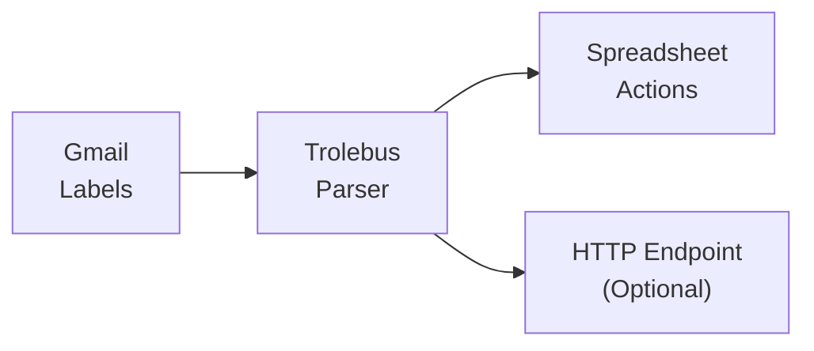

<h1 align="center">🚌 Trolebus</h1>
<p align="center">
      
      <br>
      <em>Track your personal and business banking via Google Apps Script</em>
</p>

Track your personal and business banking via Google Apps Script

A *Google Apps Script* (written in [Gleam](https://gleam.run) and compiled to JavaScript) that parses *Gmail* messages from *banks*, extracts transaction data from HTML email bodies, and saves the results to a *Google Spreadsheet* or an *HTTP endpoint*.

## 🚀 Environment setup

### Requirements

- [Google Apps Script](https://script.google.com/home).
- [Gmail](https://gmail.com).
- [Google Spreadsheets](https://docs.google.com/spreadsheets).

### Quick Installation

#### Step 1 - Configure Gmail

- Create *Gmail* [labels](https://support.google.com/mail/answer/6579?hl=en) for each *bank entity* you want to track.
- Create *Gmail* [filters](https://support.google.com/mail/answer/6579?hl=en) that automatically assign those labels to incoming bank notification emails.
- Ensure that you have some unread emails with the assigned *labels*.

Each *parser* has a designated *label* that you must configure first in your *Gmail* account. This is the way to determine which *parser* will be used to extract the data.

It's recommended to use a parent label named `trolebus` to organize your emails and labels related to *Trolebus*. **Labels must follow specific format in order to work**.

See each *parser's* label constants to know how to name your labels.

| Bank | Label | Transaction Type |
|------|-------|------------------|
| Banco Chile | `expense:cl-bancochile:payment-notifications` | Expense |

##### Pro Tip

If you want to create filters more easily you can use the plus sign `+` to create a unique email address for each entity.

For example if you got a *Netflix* account, you can use `example+netflix@gmail.com` as your account email address. Its the same as writing `example@gmail.com`. *Gmail* omits everything after the `+`. For *Netflix* it will be a valid and unique email address. For you, it means that now you can filter all emails that went to `example+netflix@gmail.com` — they all will be from *Netflix*.

#### Step 2 - Create Spreadsheet

- Create a new *Google Spreadsheet* or clone an [existing one](https://docs.google.com/spreadsheets/d/1y8osuw4cMi1n2hjEumeYlanCScvObllrt4f-iargRSA/edit?usp=sharing).
- If new, add the following column headers in the first row:

| Column | Description |
|--------|-------------|
| A | Message ID |
| B | From |
| C | Amount |
| D | Currency Code |
| E | Context |
| F | Account |
| G | Date |
| H | Time |
| I | Transaction Type |
| J | Label |
| K | Entity |
| L | Comment |
| M | Created At |
| N | Message Date |
| O | Meta (JSON) |
| P | Timestamp |

- Copy the spreadsheet URL.

#### Step 3 - Configure Google Apps Script

- Create a new project in [Google Apps Script](https://script.google.com/home/my).
- Upload the bundled code from [script/dist/script.gs](script/dist/script.gs).
- Enable [Advanced Services](https://developers.google.com/apps-script/guides/services/advanced#enabling_advanced_services): *Gmail* and *Spreadsheets*.
- Set the following [Script Properties](https://developers.google.com/apps-script/reference/properties) via Project Settings:

| Property | Required | Description |
|----------|----------|-------------|
| `SPREADSHEET_URL` | Yes | The full URL of your Google Spreadsheet. |
| `HTTP_ENDPOINT` | No | URL of an HTTP endpoint to send parsed transaction data (JSON). |

- Save and run (you will need to authorize permissions first).
- Configure a [Time-driven trigger](https://developers.google.com/apps-script/guides/triggers/installable) to execute the script periodically.

## 👩‍💻 Project explanation

This project was inspired by [Bennedetto](https://github.com/arecker/bennedetto) and [Biyete](https://github.com/NinjasCL/biyete), and the lack of proper apps and technologies in Chilean banking systems. Also to automate financial tracking and help people organize their finances better.

Following [Bart Wronski's advice](https://bartwronski.com/2016/06/26/technical-weight/), we look for simpler solutions and try to achieve the goals with the least technical weight. Normally a solution would be a huge app with lots of endpoints, [ETLs](https://en.wikipedia.org/wiki/Extract,_transform,_load) and so on.

We tried to minimize using the available tools:

- Banks normally do not have open endpoints to fetch data. But they send emails every time you purchase something or when you receive a deposit. These emails could be parsed with simple regex and sent to another place. Also other entities ("Netflix", "Spotify", etc) send a billing email that could also be parsed.

- *Gmail* has *Google Apps Scripts* that let you read, program and control emails and interact with different services.

- *Google Spreadsheets* is a wonderful place to store data and create custom dashboards. Also has *Google Apps Scripts*.

- Finances need to be secure and transparent. So using *Gmail* and *Spreadsheets* we can have an easy to use, easy to configure, low cost and secure environment to execute this script and let you have total control over your personal data (No hidden nasties).

### How does it work?

The script is written in [Gleam](https://gleam.run) and compiled to JavaScript. The build process produces a single bundled file at `dist/script.gs` that can be deployed directly into *Google Apps Script*.

The execution flow is:

1. The script fetches all unread emails within specific *Gmail labels* using individual queries per entity.
2. Each email is routed to the correct *parser* based on its entity ID (e.g. `cl.bancochile` → `banco_chile` parser).
3. The parser extracts transaction data from the HTML email body (amount, date, account, etc).
4. For every successfully parsed email, *actions* are triggered:
   - **Spreadsheet Action**: Appends a row with the transaction data to your *Google Spreadsheet*.
   - **HTTP Action**: Prepares a JSON payload and sends it to your configured *HTTP endpoint* (if set).
5. The email is marked as read.

Normally the script processes *1 thread* per execution (configurable in `config.gleam`). *Google Apps Scripts* max execution time is 6 minutes.

### Architecture



### Transaction Types

| Type | Description |
|------|-------------|
| `expense` | Money spent (purchases, payments) |
| `deposit` | Money received (transfers, donations) |
| `alert` | Bank alerts or notifications |
| `other` | Unclassified transactions |

### Currency Support

| Code | Name | Decimals |
|------|------|----------|
| `CLP` | Peso Chileno | 0 |

### Supported Banks

| Entity ID | Name | Expense | Deposit | Alert | Other |
|-----------|------|---------|---------|-------|-------|
| `cl.bancochile` | Banco Chile | ✅ | 🔲 | 🔲 | 🔲 |
| `cl.bancoestado` | Banco Estado | 🔲 | 🔲 | 🔲 | 🔲 |

## 🛠️ Development

### Prerequisites

- [Gleam](https://gleam.run) >= 1.17.0
- [Node.js](https://nodejs.org) (for pnpm and Vite)
- [Nix](https://nixos.org/download.html) (optional, for reproducible dev environment via devenv)

### Setup

Clone the repository and enter the `src` directory:

```sh
git clone https://github.com/ElixirCL/trolebus/
cd trolebus/src
```

Install dependencies:

```sh
pnpm install
```

### Build

Build the bundled `.gs` file:

```sh
pnpm run build
```

This runs Vite, which bundles the Gleam-compiled JavaScript into `dist/script.gs`.

### Using devenv (Optional)

If you have [devenv](https://devenv.sh) and [direnv](https://direnv.net) installed, the development environment is automatically activated when entering the project directory:

```sh
cd trolebus
```

## 🤩 Credits

Icon made by [Flat Icons](https://www.flaticon.com/authors/flat-icons) from [www.flaticon.com](https://www.flaticon.com/)

Made with ❤️ by [Ninjas.cl](https://ninjas.cl) and [Elixir Chile](https://elixircl.github.io) Contributors
